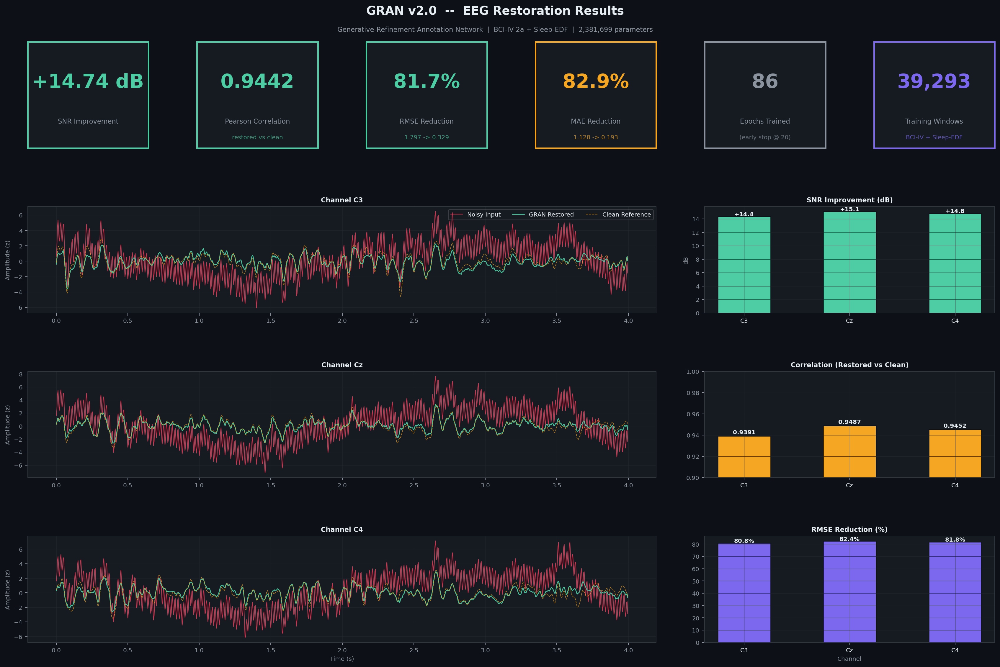
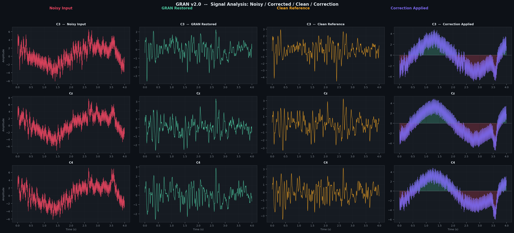
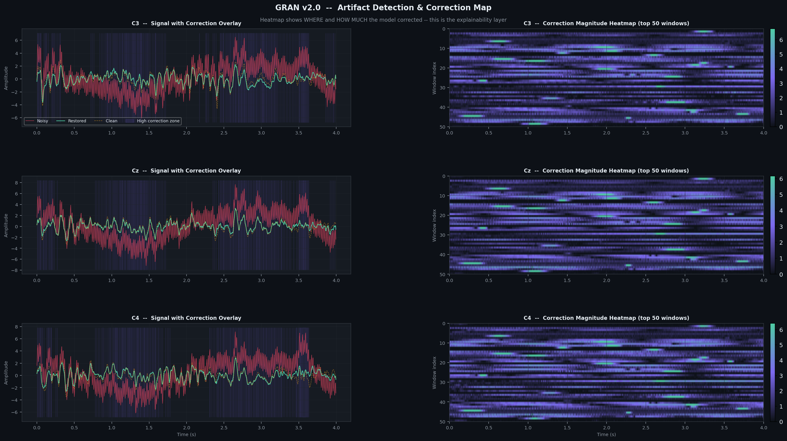

# GRAN - EEG Waves Noise Reduction

Explainable EEG signal restoration using a Generative-Refinement-Annotation framework.

## Highlights

- Deep 1D U-Net style restoration model with residual learning.
- Synthetic artifact generation for eye blink, muscle noise, drift, powerline, motion, electrode pop, and white noise.
- Annotation heatmaps showing where corrections were applied.
- Evaluation outputs include SNR, RMSE, MAE, Pearson correlation, spectrum comparison, and signal-level plots.

## Results

Metrics from `outputs_v2/metrics_v2.json`:

| Metric | Noisy | Restored | Improvement |
|---|---:|---:|---:|
| SNR | -5.09 dB | 9.65 dB | +14.74 dB |
| Pearson correlation | 0.487 | 0.944 | +0.457 |
| RMSE | 1.798 | 0.329 | 81.7% lower |
| MAE | 1.129 | 0.193 | 82.9% lower |

Training summary:

- Parameters: 2.38M
- Training windows: 39,293
- Epochs trained: 86
- Channels evaluated: C3, Cz, C4

## Repository structure

```text
src/
  TRAIN_NOW.py
outputs_v2/
  metrics_v2.json
  per_channel_metrics.json
  result plots and GIF
reports/
  GRAN_Final_Report.docx
```

## Quick start

```bash
pip install -r requirements.txt
python src/TRAIN_NOW.py --bci-only
```

The full training script expects local copies of the BCI Competition IV and Sleep-EDF datasets. Dataset files and model checkpoints are intentionally not committed because of size and licensing constraints.

## Visual outputs







## Resume-ready summary

Developed an explainable EEG denoising framework using synthetic artifact generation, a 2.38M-parameter deep restoration model, and annotation heatmaps; achieved +14.74 dB SNR improvement and 0.944 restored-signal correlation on validation outputs.
